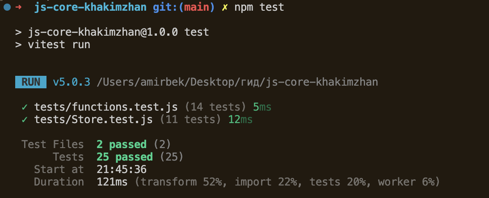

# JavaScript Core — Lab 4

This project contains JavaScript functions, classes, closures, inheritance, and unit tests.

## Functions

The project includes six functions:

- `unique(arr)` removes duplicates;
- `groupBy(arr, keyFn)` groups elements;
- `chunk(arr, size)` splits an array into parts;
- `deepClone(value)` creates a deep copy;
- `memoize(fn)` saves calculated results;
- `counter(start)` creates a counter.

## Classes

The `Store` class can add, remove, and find products. It also calculates the total price of all products.

The class uses a private `#items` field, a `count` getter, and the static method `isValidItem()`.

The `SortedStore` class inherits from `Store`. It overrides the `all()` method and uses `super.all()` to return products sorted by name.

## How to run the tests

First install the dependencies:

`npm install`

Run all tests:

`npm test`

Run tests in watch mode:

`npm run test:watch`

## Test result

## Closures in my code

I used closures in the `memoize` and `counter` functions. In `memoize`, the returned function remembers the `saved` map after the main function has finished. This allows the function to use a saved result when the same arguments are passed again. In `counter`, the methods keep access to the `current` variable. Code outside the function cannot change this variable directly. The value can only be changed using the `inc` and `dec` methods.

## AI Tools

I used ChatGPT to clarify the assignment requirements, review the project structure, and check test cases. I read the suggested code and tested it locally with Vitest.

## Author

Khakimzhan Amirbek